# ⚒️ ChronoForge — Execution Intelligence Platform


<p align="center">
  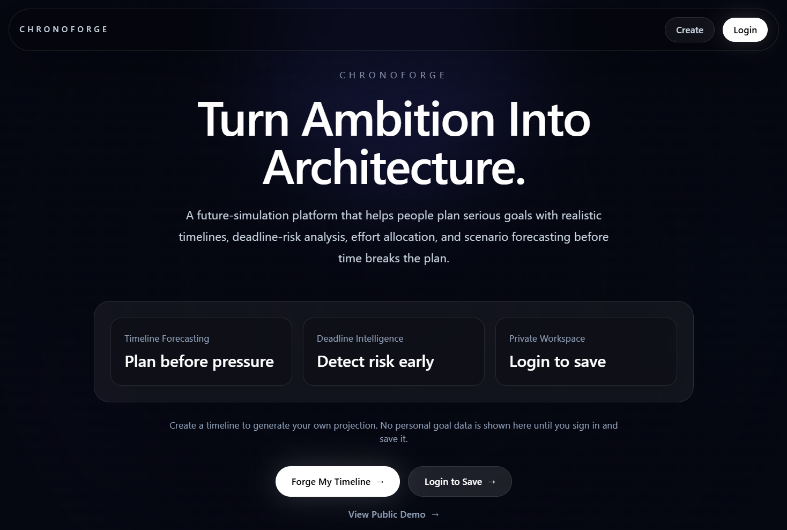
</p>

# Turn Ambition Into Architecture.

ChronoForge is a premium full-stack execution-intelligence platform built to help people **plan serious goals, simulate deadline pressure, detect burnout risk, track real progress, compare execution paths, and export structured timeline reports**.

It is not a to-do list.
It is not a habit tracker.
It is not a simple productivity dashboard.

ChronoForge is a system for answering one difficult question:

> **Can this ambition realistically survive the time, effort, capacity, and pressure required to complete it?**

Built independently over **680 hours** across **12 weeks / 3 months**, ChronoForge represents a complete product journey: concept, engine design, interface architecture, authentication, database persistence, dashboard intelligence, testing, CI, export workflows, and polished product presentation.

> Built independently while still in high school with a focus on systems thinking, execution design, product depth, and meaningful planning intelligence.

---

# 🌍 The Idea

Most people do not fail because they lack goals.

They fail because they cannot see the structure behind their goals.

They rarely know:

* how much effort the goal truly requires,
* whether their deadline is realistic,
* whether their weekly capacity is enough,
* how much recovery buffer they have,
* whether their plan is quietly drifting,
* whether the goal is achievable but unhealthy,
* which project deserves attention first.

## ChronoForge solves this.

It transforms ambition into a system of:

### Forecasting • Diagnosis • Execution • Comparison

<p align="center">
  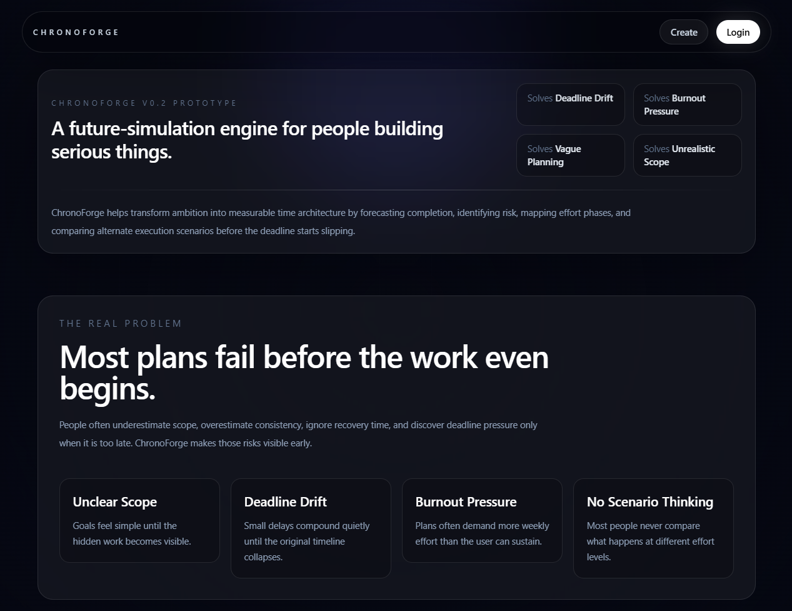
</p>

---

# 🧠 What Makes ChronoForge Different

Most planning tools ask:

> What do you want to do?

ChronoForge asks:

> What will this goal demand from your future self?

That difference matters.

ChronoForge does not simply store goals. It studies the relationship between:

* effort,
* capacity,
* time,
* pressure,
* progress,
* risk,
* recovery.

Then it converts that relationship into execution intelligence.

---

# 🛤️ 12-Week / 680-Hour Build Journey

ChronoForge was not built as a quick weekend project.

It evolved through a complete 12-week product-building journey.

## Week 1 — Product Question

The project began with one core question:

**Why do people plan goals without understanding whether the timeline can survive execution?**

This week focused on defining the problem:

* vague goals collapse under pressure,
* deadlines are often chosen emotionally,
* effort is underestimated,
* recovery is ignored,
* burnout is invisible until it arrives.

The first version of ChronoForge was born from this idea.

---

## Week 2 — ChronoEngine Foundation

The first internal engine was created.

ChronoEngine began calculating:

* projected completion days,
* required weekly hours,
* deadline risk,
* burnout risk,
* recovery buffer,
* drift percentage,
* scope pressure.

The product moved from idea to intelligence.

---

## Week 3 — Goal Architect Interface

The public planning interface was designed.

The goal was to make serious planning feel premium, focused, and intentional.

Core inputs were added:

* goal title,
* total estimated hours,
* available hours per week,
* days until deadline.

The first live forecast experience became functional.

<p align="center">
  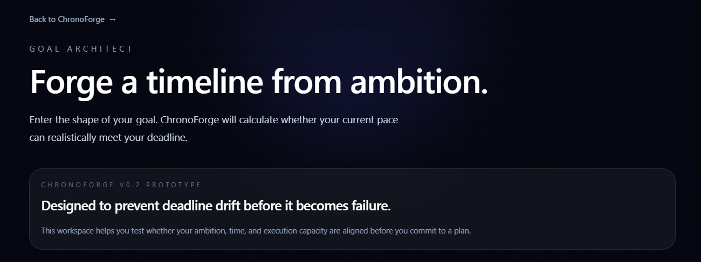
</p>

---

## Week 4 — Live Forecasting System

The interface started responding to user inputs with real projections.

ChronoForge could now show:

* ChronoScore,
* projected completion,
* deadline risk,
* burnout risk,
* weekly need,
* current capacity,
* drift.

<p align="center">
  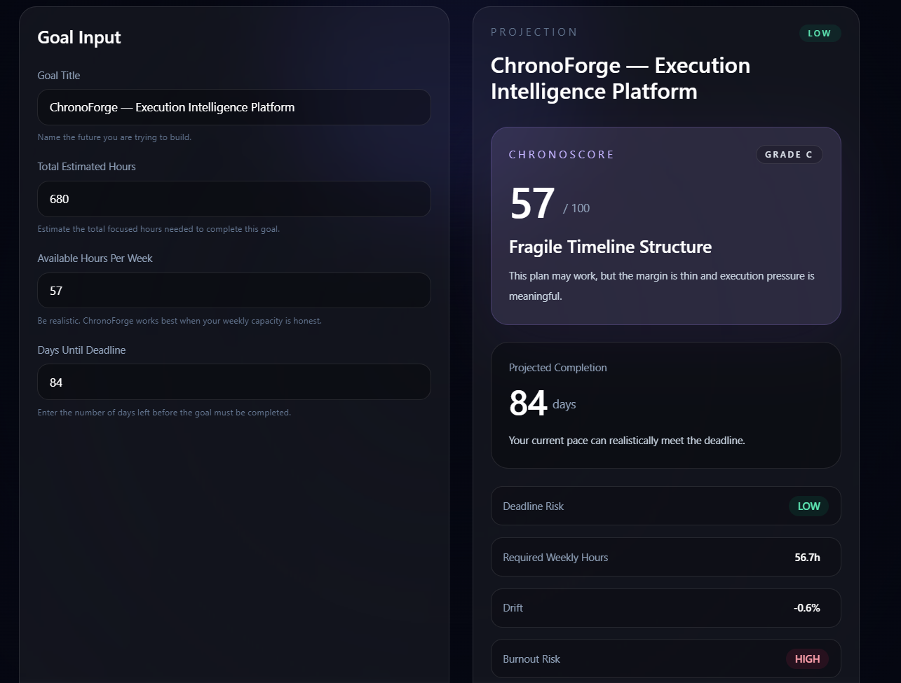
</p>

This became one of the most important product moments:

> A plan can meet its deadline mathematically while still being unhealthy to execute.

---

## Week 5 — Execution Diagnosis

ChronoForge moved beyond numbers.

The diagnosis engine was added to interpret the plan.

It detects:

* stable execution structures,
* timeline pressure warnings,
* critical execution misalignment,
* burnout-heavy plans,
* deadline-fragile plans.

<p align="center">
  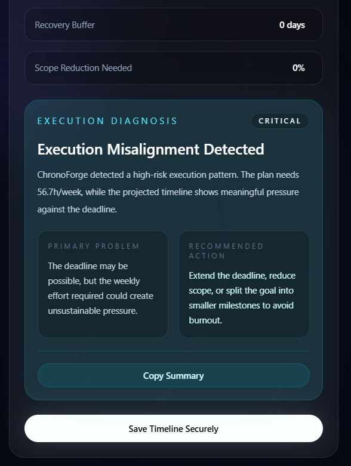
</p>

The product became more than a calculator.

It became a decision-support system.

---

## Week 6 — Timeline Architecture

The system began breaking goals into phases.

Each goal could now become a structured architecture:

* Foundation,
* Core Build,
* System Expansion,
* Polish & Launch.

<p align="center">
  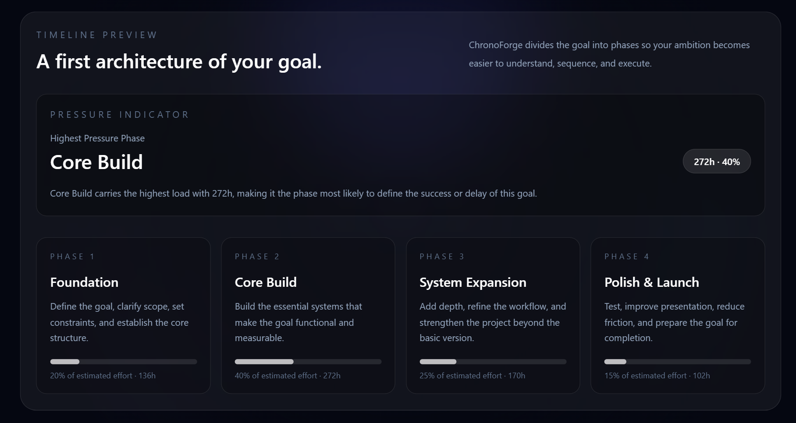
</p>

This made ChronoForge feel like a real execution-design platform.

---

## Week 7 — Scenario Simulation

The scenario simulator was added.

ChronoForge could now compare different weekly effort levels and show how the future changes.

<p align="center">
  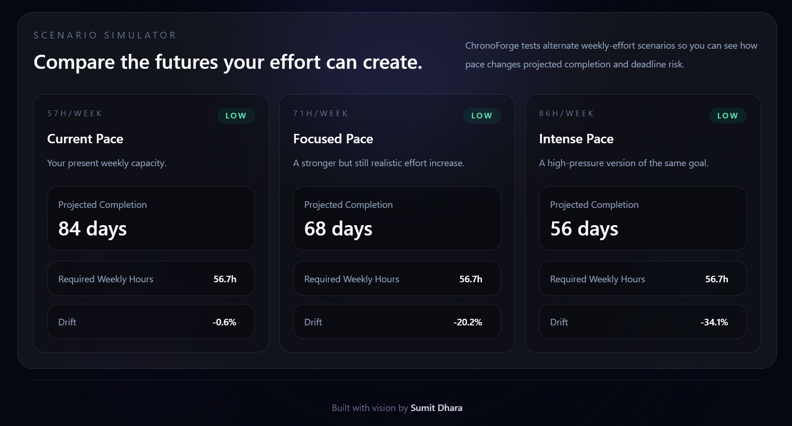
</p>

This helped answer:

* What happens at my current pace?
* What happens if I increase effort?
* What happens if I push intensely?
* What is the cost of speed?

---

## Week 8 — Authentication and Private Workspace

ChronoForge became a private product.

Supabase Auth was integrated for:

* sign up,
* login,
* authenticated sessions,
* private timeline ownership.

<table>
<tr>
<td width="50%">
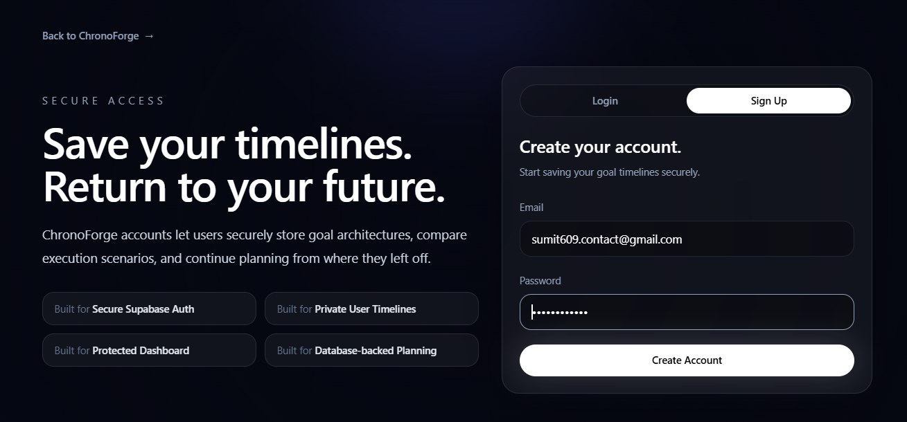
</td>
<td width="50%">
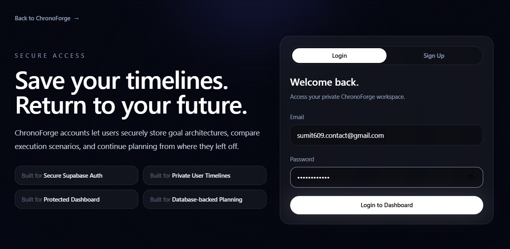
</td>
</tr>
</table>

This transformed ChronoForge from a public simulator into a saved planning workspace.

---

## Week 9 — Timeline Vault

Saved timelines were introduced.

Users could now:

* create private plans,
* view saved reports,
* open timeline details,
* return to previous plans,
* manage multiple goals.

The Timeline Vault became the foundation of the private dashboard.

---

## Week 10 — Vault Intelligence

The dashboard became intelligent.

Instead of only showing saved plans, ChronoForge began analyzing the entire workspace.

<p align="center">
  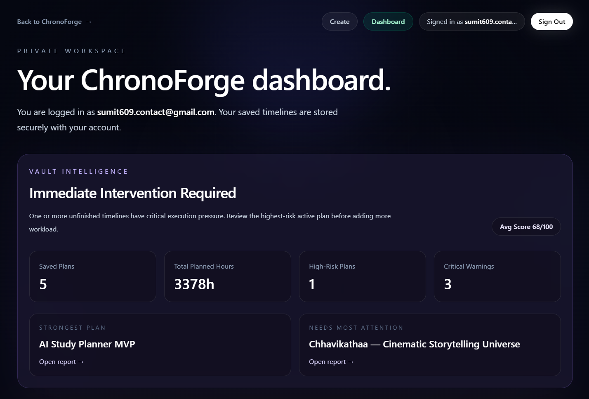
</p>

Vault Intelligence shows:

* total saved plans,
* total planned hours,
* average ChronoScore,
* high-risk plans,
* critical warnings,
* strongest plan,
* plan needing most attention.

This made the dashboard feel like an execution command center.

---

## Week 11 — Execution Tracking and Comparison

ChronoForge became connected to real progress.

Execution states were added:

* Planning,
* Active,
* Paused,
* Completed.

Progress tracking was added from `0%` to `100%`.

<p align="center">
  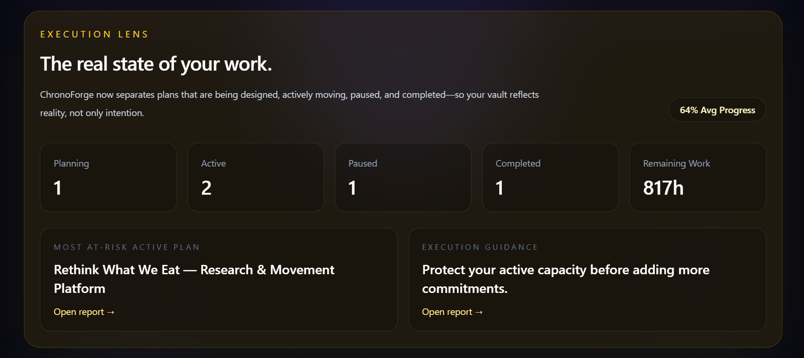
</p>

Then the comparison engine was created.

ChronoForge could compare two serious projects and generate a verdict.

<p align="center">
  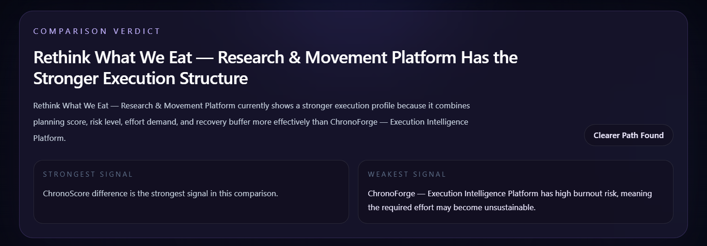
</p>

---

## Week 12 — Export, Testing, CI, and Polish

The final phase focused on reliability and presentation.

Major additions:

* export-ready timeline reports,
* print workflow,
* export tracking,
* loading states,
* error states,
* custom 404 page,
* unit tests,
* preflight quality gate,
* GitHub Actions CI,
* README visual system,
* screenshot documentation.

<p align="center">
  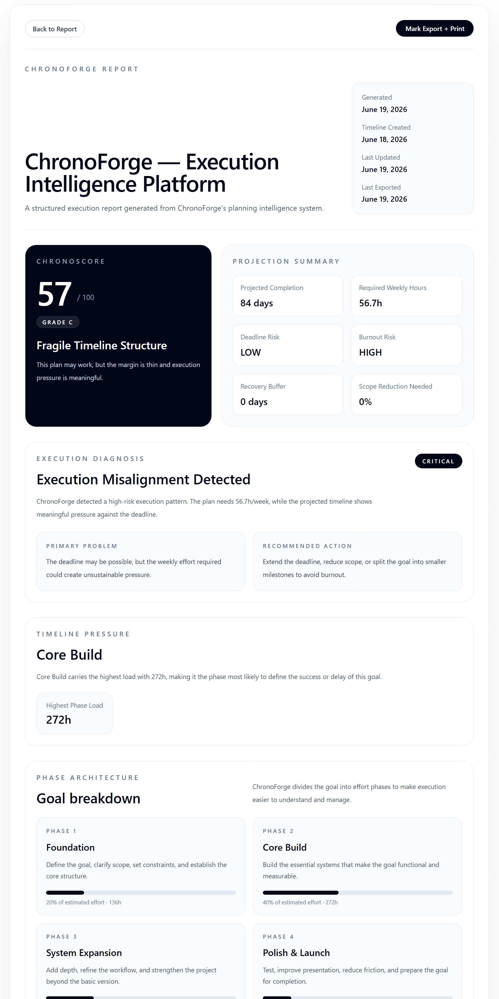
</p>

ChronoForge became a complete, presentable product.

> ChronoForge was not built quickly.
> It was forged through 680 hours of planning, debugging, redesigning, testing, and refinement.

---

# 🔥 Current Product Version

## ⚒️ ChronoForge Web Platform

A full-stack execution-intelligence platform with:

* public goal forecasting,
* private authenticated workspace,
* saved timeline vault,
* execution tracking,
* dashboard intelligence,
* timeline comparison,
* print-ready reports.

## 🧠 ChronoEngine

The custom planning engine behind ChronoForge.

It calculates:

* projected completion,
* required weekly hours,
* deadline risk,
* burnout risk,
* recovery buffer,
* drift percentage,
* scope reduction,
* execution recommendation.

---

# ✨ Core Features

## 🧭 Goal Architect

Create a structured timeline from three core inputs:

* total estimated effort,
* weekly availability,
* deadline duration.

<p align="center">
  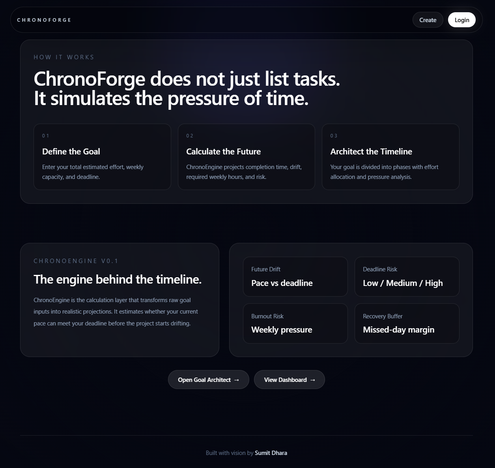
</p>

---

## 📊 ChronoScore

Every plan receives a score from `0–100`.

| Grade | Meaning                          |
| ----- | -------------------------------- |
| A     | Strong Execution Architecture    |
| B     | Workable Plan With Some Pressure |
| C     | Fragile Timeline Structure       |
| D     | High-Risk Execution Plan         |

ChronoScore is based on:

* deadline risk,
* burnout risk,
* recovery buffer,
* scope pressure.

---

## ⚠️ Risk Intelligence

ChronoForge separates different types of risk.

A project can have:

* low deadline risk,
* high burnout risk,
* no recovery buffer,
* heavy weekly pressure.

This matters because finishing on time does not always mean the plan is healthy.

<p align="center">
  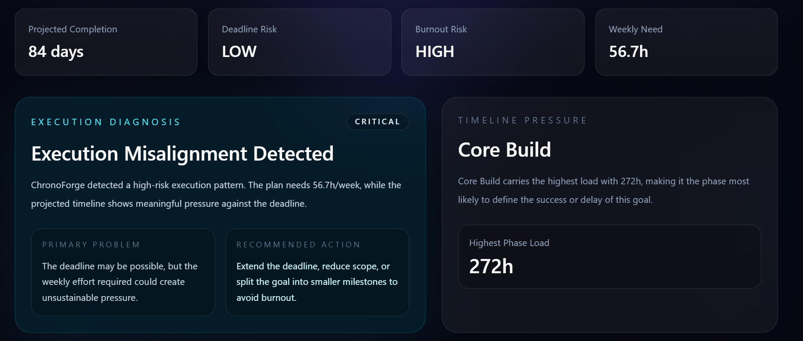
</p>

---

## 🏗️ Phase Architecture

Every goal becomes an execution structure.

<p align="center">
  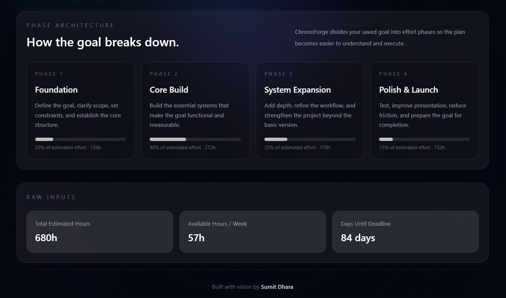
</p>

Each phase receives:

* percentage allocation,
* estimated hours,
* execution description,
* pressure context.

---

## 🔐 Private Timeline Vault

Authenticated users can save and manage multiple plans.

<p align="center">
  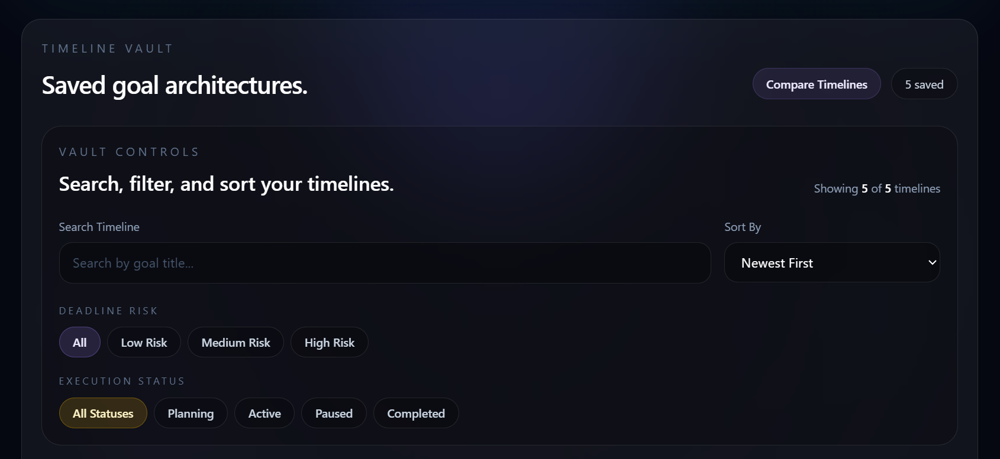
</p>

The vault supports:

* search,
* risk filtering,
* status filtering,
* sorting,
* report access.

<table>
<tr>
<td width="50%">
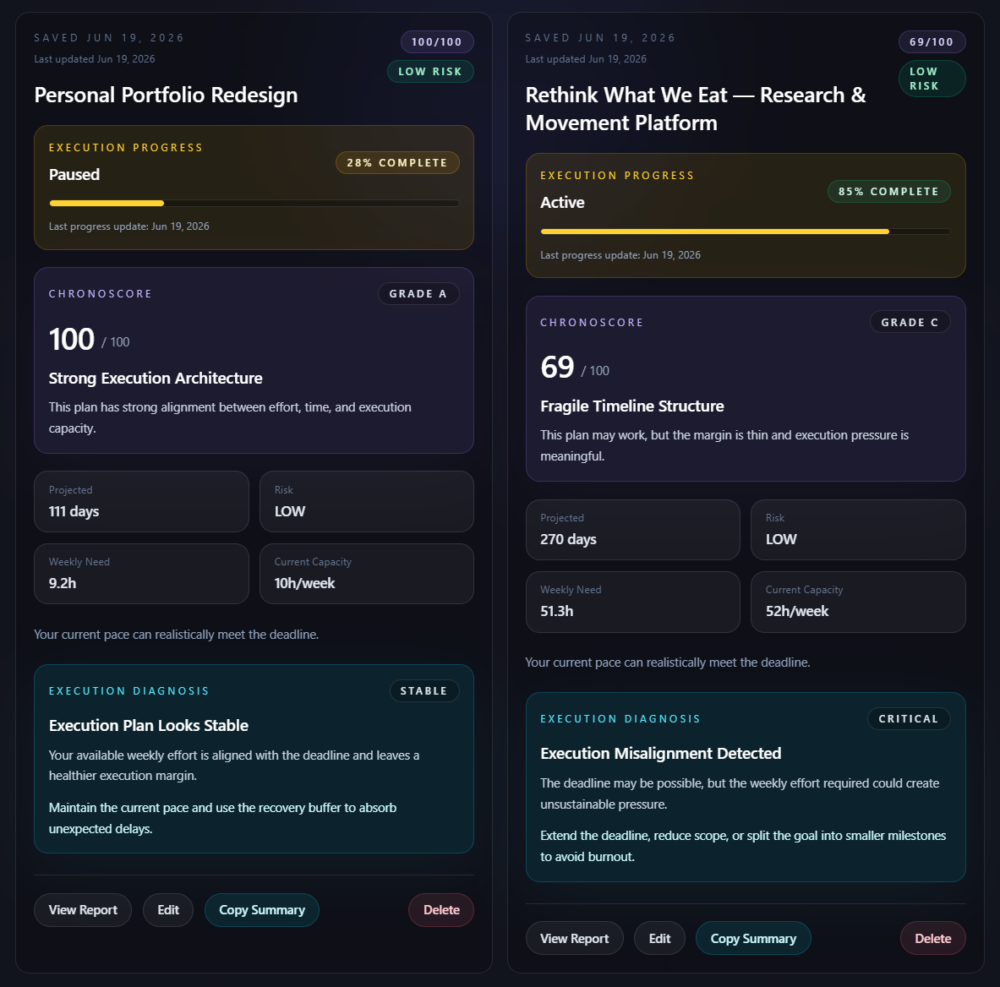
</td>
<td width="50%">
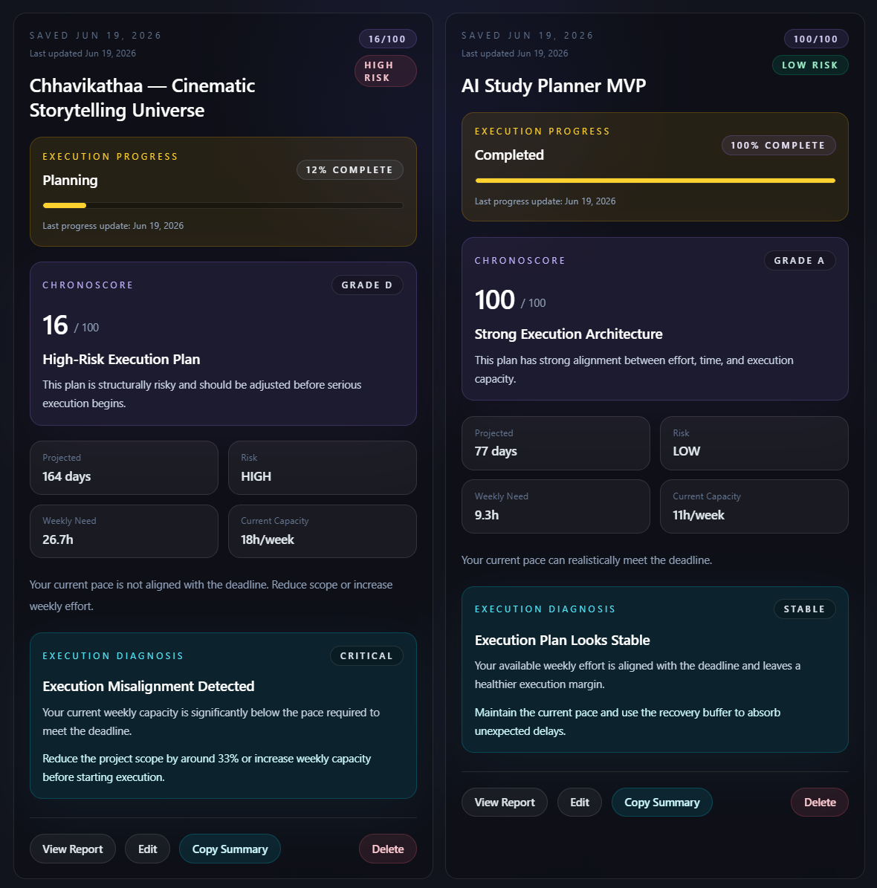
</td>
</tr>
</table>

---

## 🧠 Vault Quick Insights

ChronoForge analyzes the full workspace and surfaces important signals automatically.

<p align="center">
  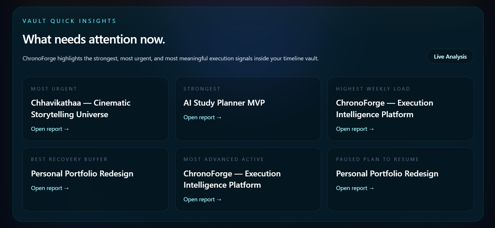
</p>

It identifies:

* most urgent plan,
* strongest plan,
* highest weekly load,
* best recovery buffer,
* most advanced active plan,
* paused plan to resume.

---

## 📈 Execution Progress Tracking

ChronoForge is not only for planning before the work begins.

It also tracks execution after the plan starts.

<p align="center">
  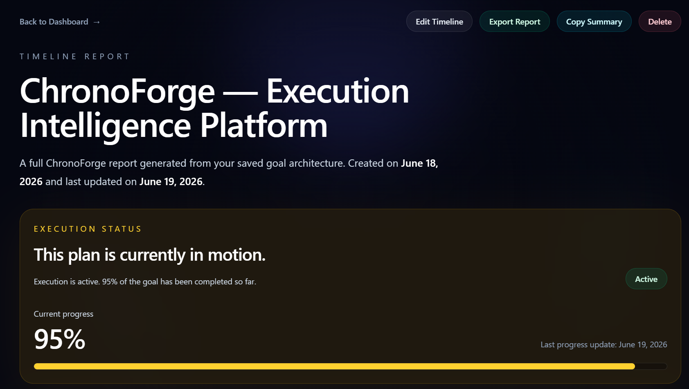
</p>

Users can update:

* status,
* progress percentage,
* execution state.

<p align="center">
  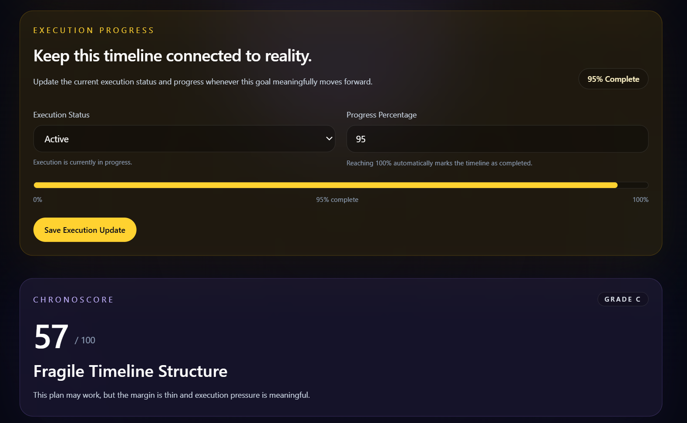
</p>

---

## ⚖️ Timeline Comparison

ChronoForge can compare two serious goals before the user decides where to focus.

For the main demonstration:

| Project                                            |     Effort | Timeline |
| -------------------------------------------------- | ---------: | -------: |
| ChronoForge — Execution Intelligence Platform      |  680 hours | 12 weeks |
| Rethink What We Eat — Research & Movement Platform | 2000 hours | 9 months |

<p align="center">
  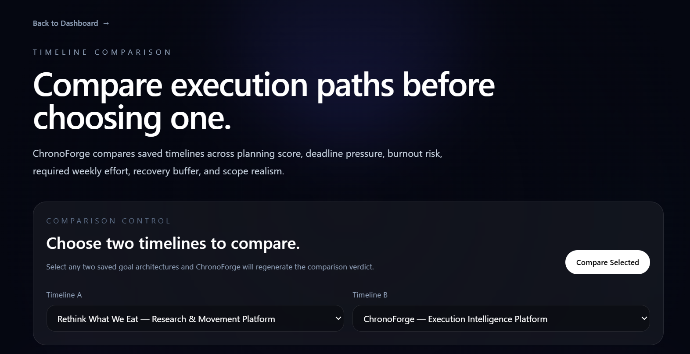
</p>

<p align="center">
  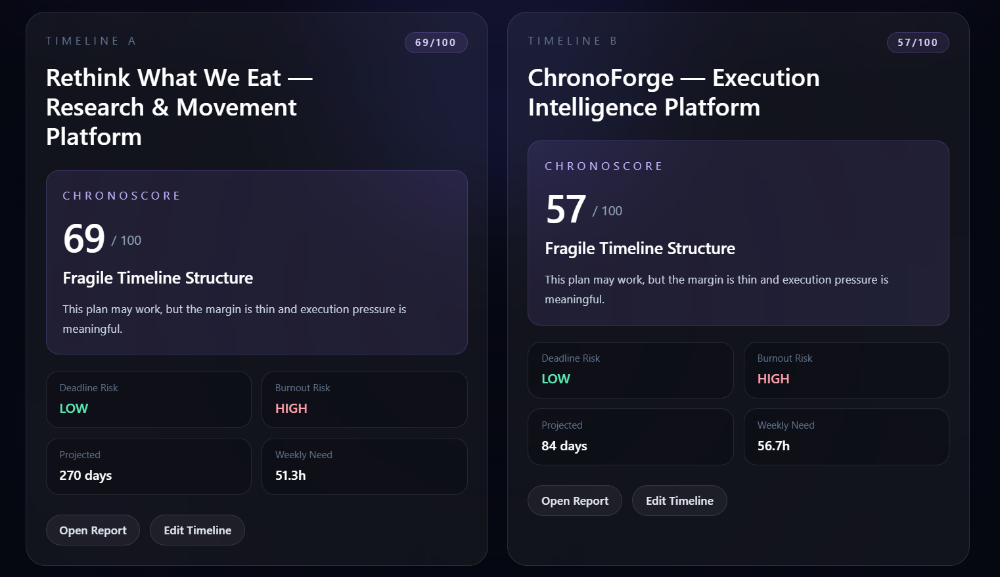
</p>

<p align="center">
  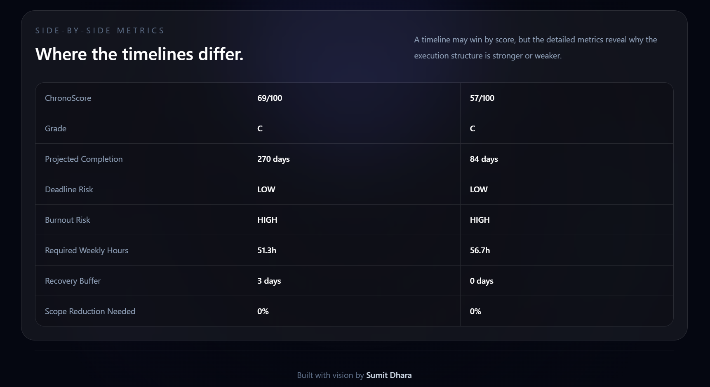
</p>

The comparison engine evaluates:

* ChronoScore,
* deadline risk,
* burnout risk,
* weekly effort,
* recovery buffer,
* structural weakness.

---

## 🖨️ Exportable Timeline Reports

ChronoForge can generate print-ready reports.

<p align="center">
  
</p>

Each exported report includes:

* project title,
* ChronoScore,
* projection summary,
* execution diagnosis,
* timeline pressure,
* phase architecture,
* created timestamp,
* updated timestamp,
* exported timestamp.

---

# 🧩 Demo Workspace

The README demonstration uses a realistic private workspace with five timelines.

| Timeline                                           | Effort | Status    | Progress |
| -------------------------------------------------- | -----: | --------- | -------: |
| ChronoForge — Execution Intelligence Platform      |   680h | Active    |      95% |
| Rethink What We Eat — Research & Movement Platform |  2000h | Active    |      85% |
| Chhavikathaa — Cinematic Storytelling Universe     |   420h | Planning  |      12% |
| Personal Portfolio Redesign                        |   160h | Paused    |      28% |
| AI Study Planner MVP                               |   120h | Completed |     100% |

This workspace demonstrates:

* active high-effort projects,
* paused work,
* completed execution,
* future planning,
* multi-project comparison,
* dashboard-level intelligence.

---

# 🛠️ Tech Stack

## Frontend

* Next.js 16
* React 19
* TypeScript
* Tailwind CSS 4

## Backend and Data

* Supabase Auth
* Supabase PostgreSQL
* Row Level Security
* Server-side Supabase client
* Client-side authenticated operations

## Product Logic

* Custom ChronoEngine
* ChronoScore system
* Execution diagnosis engine
* Timeline phase generator
* Comparison engine
* Vault intelligence engine
* Quick insight engine

## Reliability

* Vitest
* ESLint
* Production build checks
* Local preflight script
* GitHub Actions CI

---

# 🧪 Testing and Reliability

ChronoForge includes tests for the most important custom logic.

Current baseline:

```txt
5 test files passed
20 tests passed
```

Covered systems:

* ChronoEngine projections,
* ChronoScore grading,
* diagnosis logic,
* timeline comparison,
* vault intelligence,
* vault quick insights.

Run tests:

```bash
npm test
```

Run full quality gate:

```bash
npm run preflight
```

Preflight runs:

```txt
Lint → Tests → Production Build
```

Expected result:

```txt
✓ ChronoForge preflight passed.
```

---

# 🚀 Getting Started

## Clone Repository

```bash
git clone https://github.com/sumitdhara609/chronoforge.git
cd chronoforge
```

## Install Dependencies

```bash
npm install
```

## Environment Setup

Copy the example environment file:

```bash
cp .env.example .env.local
```

On Windows PowerShell:

```powershell
Copy-Item .env.example .env.local
```

Add your Supabase values:

```env
NEXT_PUBLIC_SUPABASE_URL=
NEXT_PUBLIC_SUPABASE_ANON_KEY=
```

Never commit `.env.local`.

## Run Development Server

```bash
npm run dev
```

Open:

```txt
http://localhost:3000
```

---

# 🗄️ Supabase Setup

ChronoForge uses a `timelines` table connected to authenticated users.

Core fields:

```txt
id
user_id
goal_title
total_estimated_hours
available_hours_per_week
days_until_deadline
created_at
updated_at
last_exported_at
execution_status
progress_percentage
last_progress_updated_at
```

The table should use Row Level Security so users can only access their own timelines.

---

# 📂 Project Structure

```bash
ChronoForge/
│── README.md
│── package.json
│── .env.example
│
├── app/
│   ├── page.tsx
│   ├── create/
│   ├── login/
│   ├── demo/
│   ├── dashboard/
│   ├── auth/
│   ├── error.tsx
│   └── not-found.tsx
│
├── components/
│   ├── auth-navigation.tsx
│   ├── timeline-progress-editor.tsx
│   ├── timeline-vault-filter.tsx
│   ├── export-tracker-button.tsx
│   └── ...
│
├── lib/
│   ├── chrono-engine.ts
│   ├── chrono-score.ts
│   ├── diagnosis-engine.ts
│   ├── timeline-generator.ts
│   ├── comparison-engine.ts
│   ├── vault-intelligence.ts
│   └── vault-quick-insights.ts
│
├── public/
│   └── readme/
│       └── screenshots/
│
├── scripts/
│   └── preflight.mjs
│
├── supabase/
│   └── migrations/
│
└── tests/
```

---

# 🔐 Security Notes

* `.env.local` is ignored.
* `.env.example` is safe to commit.
* Service-role keys must never be exposed through `NEXT_PUBLIC_*`.
* Timeline rows belong to authenticated users.
* Row Level Security protects private timeline data.
* The app uses Supabase authentication for private workspace access.

---

# 🌱 Roadmap

Future directions include:

* milestone-level execution tracking,
* timeline recalculation from real progress,
* weekly execution check-ins,
* historical timeline snapshots,
* richer scenario simulation,
* calendar-aware planning,
* deeper export formats,
* shared workspaces,
* mobile-first experience.

---

# 🧠 Why I Built This

I wanted to build more than a productivity app.

I wanted to build a system that asks whether a goal is actually executable.

ChronoForge was created from the belief that serious ambition deserves more than motivation. It deserves structure, forecasting, pressure analysis, and a clear view of what the future will demand.

A plan should not simply look inspiring.

It should be honest.

---

# 👤 Author

**Sumit Dhara**
Student developer building thoughtful systems around execution, learning, productivity, and long-term growth.

---

# ⭐ Support

ChronoForge took **680 hours** across **12 weeks** to reach this stage.

If you appreciate independent builders who keep improving until ideas become real systems, consider giving this repository a **star**.

---

<p align="center">
  <strong>A goal is not a plan until effort, capacity, time, and risk are visible together.</strong>
</p>
